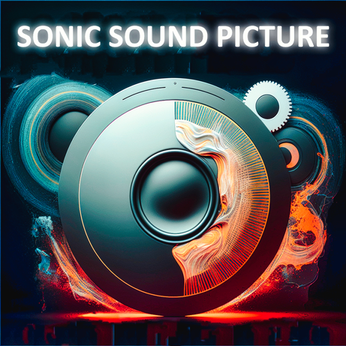
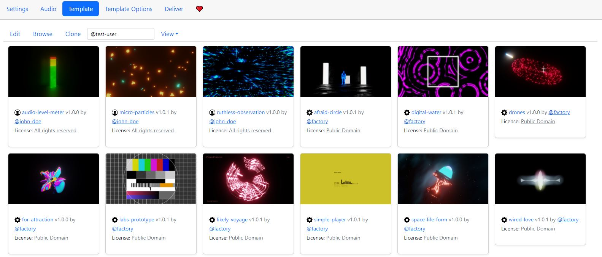
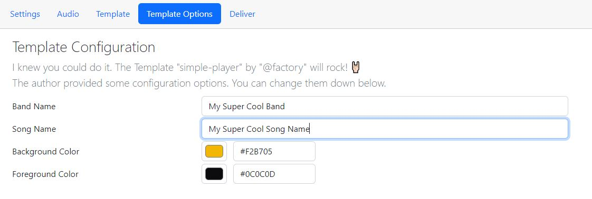
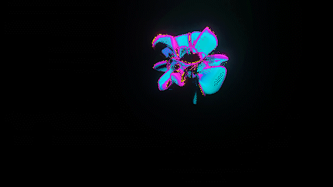
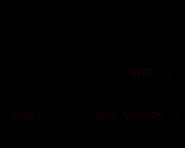
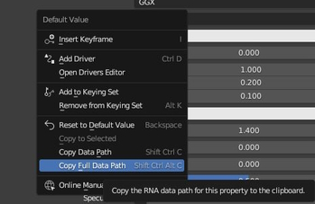

# Sonic Sound Picture | Music/Audio Visualizer Software



Sonic Sound Picture (SSP) Cross platform Music Visualizer Software based on Blender 

## Links

- [Download](https://github.com/s-a/sonic-sound-picture/releases) 
- [Join the discord server](https://discord.com/invite/MaKtp6jx3T) 

### Workflow


#### 1. Select Audio 


#### 2. Select a template 



#### 3. Template configuration



#### 4. Deliver video file


### Template Example showcases

More at our Discord Server...

#### Real World Showcase on YouTube (Click the image)

[](https://www.youtube.com/watch?v=CkwoATMSfSs)

#### Afraid Circle


#### For Attraction 



#### Drones


#### Davinci Resolve Transparent Video useful for Podcasts


## Create new templates 

If you create and new template your are invited to share it with community or at least a showcase on our discord server. I am very excited to see what a real blender artist could do with this software 🤙. 

### Blueprint Showcase



### Add a new fresh template blend file

To create your own template in the Sonic Sound Picture (SSP) application, follow these steps. The easiest way is to create a clone of an existing template by simply copy and adjust the files

1. Copy a factory template folder located for example `<app_dir>\templates\@factory\labs-prototype` to `C:\<username>\AppData\Roaming\ssp\templates\@john-doe\my-cool-template` where `@john-doe` ist your artist username and `my-cool-template` should be a short name of your template. You can find the exact path to factory templates on your system by hovering over the template image in the GUI or quick jump to folder with the context menu `{Templates}`. You can clone any factory template you like to start with.

	

2. Open your cloned `template.blend` and adjust anything except the `empty` `SONIC_SOUND_PICTURE_DATA_STORAGE` object. This object is important because it holds custom properties for audio dynamics visualization automation.

3. Adjust `template.json` and `template.png`.

4. Restart the app. After All these steps are done your new template apers at ***step 2 workflow (select template)***

A template folder for example `C:\<username>\AppData\Roaming\ssp\templates\@john-doe\my-cool-template` needs 3 files to be valid.
- `template.blend` (Blender template file)
- `template.json` (Template configuration)
- `template.png` (480x270 Template preview for SSP GUI)

### Creator process workflow

1. Adjust your `.blend` file.
2. Render with SPP output type `blender` instead of `video`.
3. Check the result by opening the rendered file and simply play it within blender.
4. Return to step 1 until you are finished and happy with the result.


### Automation basics

The `empty` `SONIC_SOUND_PICTURE_DATA_STORAGE` contains already `custom properties`. There are also `custom properties` to visualize the frequency bands. 
You can create up to 16 bands. All these properties will be automated by SSP software (bands in range from `0` to `1`). The simple magic behind all this stuff is to bind a driver to any object you can imagine in blender. Scale.Z or color emission strength. You name it. 

#### Automated Properties

These properties will be automated before rendering process but you can play around with theses values while template creation process.

| Name | Range | Type | Description |
| ---- | ----- | ---- | ----------- |
| scene_fps | between 24 and 60 | Constant | (internal use) needed to sync computation of effects in sync between beats per minute of a song and the frames per second of a video |
| song_beat_id | 1-4 | Variable | Beat counter in sync with a song |
| song_bpm | 0-n | Constant | The beats per minute of a song |
| song_frequency_band_00 | 0-1 | Variable | The amplitude value of a frequency spectrum range in relation of values between `0` and `1`. You can create up to 16 bands `..._band_00` to `..._band_15`. SSP software will split up the audio frequency ranges evenly between available bands in your template |
| song_impulse | 0-1 | Variable | Song impulse pulsing in a time range of one bar from `0` to `1` |
| song_length_seconds | 0-n | Variable | Song length in seconds |
| song_progress | 0-1 | Variable | Song Progress |
| song_section_id | 0-n | Variable | Song section detected by SSP software where each section describes a specific within a song represented by a number. For example intro, chorus, verse, outro etc. |


### Template configuration definition

`template.json` schema is defined as follows.

#### template.json properties

| Key | Description |
| --- | ----------- |
| version | your template file version |
| minBlenderVersion | minimal required blender version (needed if you use edge brand new blender functions only available in newer versions.) |
| allowCompositionNode | determines if the user is allowed to activate the composition node of the blend file while rendering |
| allowTransparent | determines if the user is allowed to render the video with a transparent background |
| description | a short description of your template |
| parms | the parameter collection you want to provide |

#### Custom template parameters

In your template configuration you can also add custom properties which can be changed by the user while template configuration (see ***step 3 of workflow***) For example colors, texts, images, logos etc. Each of theses custom properties become a `parms` object within your new `template.json`. You can create aas much parameters as you want.

A `parms` schema is defined as follows.

| Key | Description |
| --- | ----------- |
| type | (text \| file \| color) defines the type if input for the user |
| title | defines title of input |
| value | defines default value of the input |
| path | defines the blender path selector to object within the blend file |

Each path can be easy observed with a blender context menu (Copy Full Data Path). 


#### template.json example

```javascript
{
	"version": "1.0.1",
	"minBlenderVersion": "3.4.1",
	"allowCompositionNode": false,
	"allowTransparent": true,
	"description": "For testing and development purposes. All features are implemented based on this template. It contains some prototypes for display elements and all necessary attributes.  This template is therefore perfect as a blueprint for new template creations.",
	"parms": [
		{
			"type": "text",
			"title": "Songname",
			"value": "",
			"path": "bpy.data.objects[\"Text.004\"].modifiers[\"GeometryNodes\"][\"Input_2\"]"
		},
		{
			"type": "file",
			"title": "Image",
			"accept": "image/png, image/gif, image/jpeg",
			"path": "bpy.data.images[\"000013.1769220830.png\"].filepath"
		},
		{
			"type": "color",
			"title": "Color",
			"value": "#ff00ff",
			"path": "bpy.data.materials[\"Material.001\"].node_tree.nodes[\"Emission\"].inputs[0].default_value"
		}
	]
}
```

